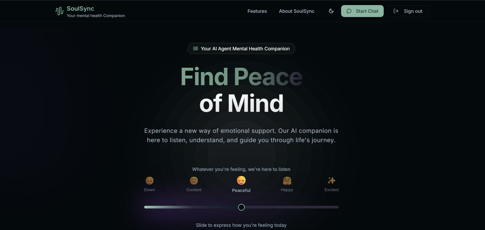
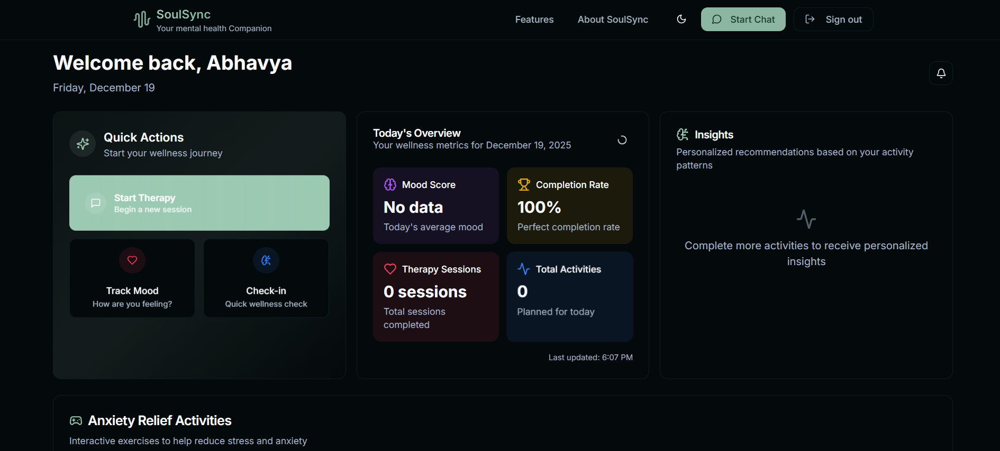
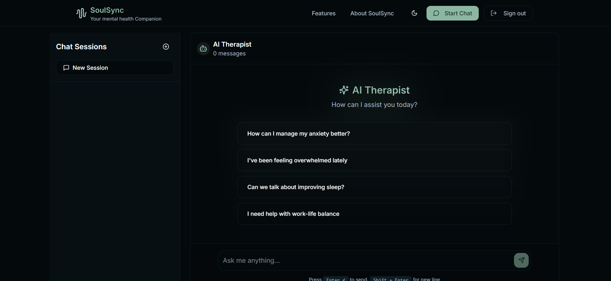
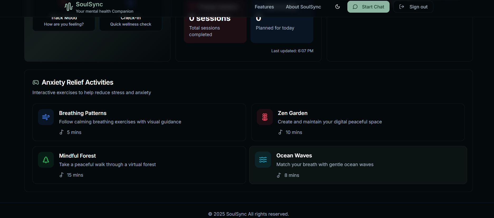

# SoulSync - AI Therapist 🤖💬

  

SoulSync is a **modern AI-powered therapy assistant** that helps users reflect, track emotions, and get guidance through conversational AI. Built to be intuitive, secure, and supportive, SoulSync is your personal AI companion for mental wellness.

---

## Features ✨

- **AI-Powered Conversations**: Chat with an AI therapist for emotional guidance and reflection.  
- **Emotion Tracking**: Log moods and visualize your emotional journey over time.  
- **Secure & Private**: User data is kept safe and confidential.  
- **Responsive Design**: Works seamlessly on desktop and mobile devices.  
- **Interactive UI**: Easy to use with clean and modern interface.  

---

## Screenshots 📸

 &nbsp;
 &nbsp;

---

## Technologies Used 🛠️

- **Frontend:** React.js, Tailwind CSS, Axios  
- **Backend:** Node.js, Express.js  
- **AI Integration:** OpenAI GPT API  
- **Database:** MongoDB
- **Authentication:** JWT 
---
